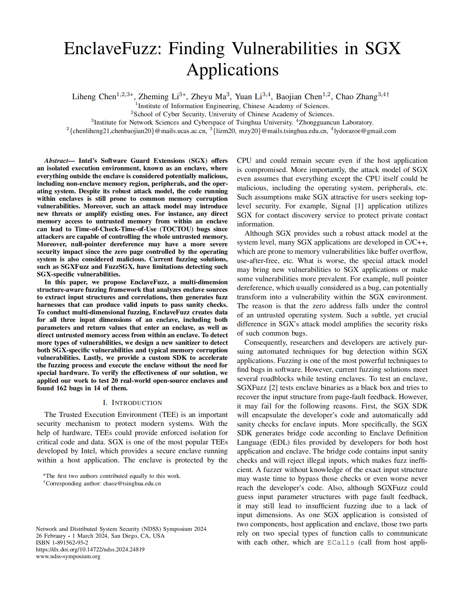

# EnclaveFuzz: Finding Vulnerabilities in SGX Applications
This repo is the public code for paper [EnclaveFuzz](EnclaveFuzz.pdf) ([slide](EnclaveFuzzSlide.pdf)) in [NDSS 2024](https://www.ndss-symposium.org/ndss2024/)

# Branch
Fuzzer2.0 - Use fuzzing optimized SGX SDK for fuzz

Fuzzer1.0 - Use original SGX SDK for fuzz (support hardware mode and simulation mode)

# Platform
Ubuntu 20.04

LLVM 13

# How to use
## Get all submodule
```bash
git submodule update --init --recursive
```

# Install dependencies
TODO: Please notify me

## Build SVF
SensitiveLeakSan depends on SVF
```shell
export LLVM_DIR=/usr/lib/llvm-13 # If you already installed llvm-13 like 'sudo apt install clang-13 llvm-13 lld-13'
./build_svf.sh
```

## Prepare kAFL (Optional)
If you want to use kAFL as fuzz engine, please prepare kAFL. Deatiled installation guide please refer to [kAFL Doc](https://intellabs.github.io/kAFL/tutorials/installation.html)
```shell
cd kAFL
make deploy
cd ..
```

## Prepare complete source code of linux-sgx
```shell
./BeforeGetSDK.sh
```
or install original SGX SDK, it will prepare complete source code of linux-sgx and install original SGX SDK at /opt/intel/
```shell
cd ThirdParty/linux-sgx-build-scripts
./prepare.sh
./build_install.sh [DEBUG=1] # [DEBUG=1] means DEBUG=1 is optional argument passed to script
# ./uninstall.sh # Uninstall SGXSDK
# ./unprepare.sh # Clean environment of you machine and clean linux-sgx repo
cd ../..
```

## Build EnclaveFuzz and get optimized SGX SDK
```shell
./build.sh [MODE=RELEASE|DEBUG] [FUZZER=LIBFUZZER|KAFL] # Default MODE is DEBUG, default FUZZER is LIBFUZZER (first choice is default)
./GetSDK.sh [MODE=RELEASE|DEBUG] [FUZZER=LIBFUZZER|KAFL] [SILENT=TRUE|FALSE] [SDK_VER=2_19|2_14] [INST_COV=TRUE|FALSE] # INST_COV means instrument coverage collection code at SGX SDK
# ./clean.sh # clean EnclaveFuzz and optimized SGX SDK
```
## Get prepared SGX applications
We have prepared all modified SGX applications which we can directly fuzz.
```shell
git clone git@github.com:LeoneChen/SGX_APP.git
```

### Branch of each SGX application
Fuzzer2.0 - Use fuzzing optimized SGX SDK for fuzz

Fuzzer1.0 - Use original SGX SDK for fuzz (support hardware mode and simulation mode)

sgxfuzz - Use SGXFuzz for fuzz

### How we modify them
[ehsm](https://github.com/LeoneChen/ehsm) as an example, we forked from original repo, and add usually one commit (e.g. [commit for ehsm](https://github.com/LeoneChen/ehsm/commit/70948b65019b2b59fb23fe8af573dbfd54696c13)) above it. Use `build.sh [MODE=RELEASE|DEBUG] [FUZZER=LIBFUZZER|KAFL]` to build it, and use `clean.sh` to clean it, these scripts are added by us.

Some repo is build with Autotool, like [BiORAM-SGX](https://github.com/LeoneChen/BiORAM-SGX), you need use `./bootstrap && build.sh [MODE=RELEASE|DEBUG] [FUZZER=LIBFUZZER|KAFL]` or something like that.

All modification made by us can be found in commit.

# Contact to me
Any questions are welcomed, you can ask them via issue or my email.

My Email: 791960492@qq.com
